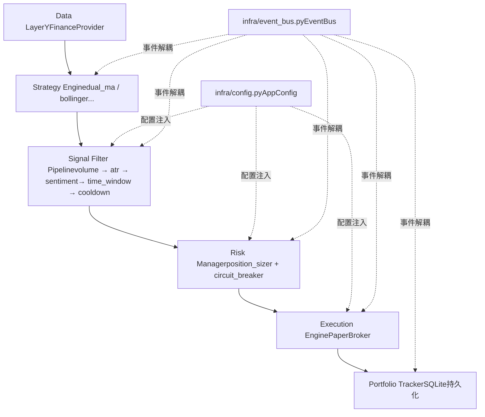

## 用户需求

按照 CODEBUDDY.md 中推荐的实现顺序，完整实现 Phase 2 的所有核心模块。

## 产品概述

Phase 2 将在 Phase 1（Data Layer + Strategy Engine + Backtest）的基础上，构建完整的实盘辅助链路：

- **信号过滤层**（Signal Filter）：从策略产生的原始信号中剔除低质量信号
- **风险管理层**（Risk Manager）：计算仓位大小、设定止损止盈、全局熔断保护
- **执行引擎**（Execution Engine）：Paper Trading 模拟成交，生成订单 JSON，不自动真实下单
- **持仓追踪器**（Portfolio Tracker）：实时维护持仓状态、FIFO 盈亏计算、SQLite 持久化
- **基础设施**（Infrastructure）：Pydantic Config + EventBus，为所有模块提供配置和事件总线

## 核心功能

- **infra/config.py**：Pydantic BaseSettings，读 YAML + .env 覆盖，类型安全
- **signal**：5 个可插拔过滤器（成交量/ATR/市场情绪/时间窗口/冷却期）+ 过滤流水线 + FilterResult 统计
- **risk**：固定金额法 + ATR 波动率仓位法 + 固定止损 + ATR 跟踪止损 + 三层熔断 + 仓位约束
- **execution**：PaperBroker（下一 bar 开盘价 * (1+滑点)成交）+ OrderResult + 幂等性订单 ID
- **portfolio**：Position/Portfolio/TradeRecord 数据结构 + FIFO 盈亏计算 + SQLAlchemy 持久化 + 关键指标（Sharpe/MaxDD/Calmar）
- **infra/event_bus.py**：同步发布/订阅，单 handler 异常不阻塞其他 handler
- **Phase 2 集成示例 + 测试**：覆盖各模块 + 端到端流水线测试

## 技术栈

- **Python 3.12**，现有环境 `/Users/rickouyang/miniforge3/envs/py312trade/bin/python`
- **pydantic + pydantic-settings**（已在 pyproject.toml 中，`>=2.6.0`）：Config 类型安全
- **PyYAML**（已有）：读取 `config/default.yaml`
- **loguru**（已有）：结构化日志，复用 Phase 1 实践
- **SQLAlchemy**（Phase 2 新增）：SQLite ORM，交易记录 + 持仓快照持久化
- **pandas / numpy / pandas-ta**（已有）：过滤器计算（ATR、成交量均值等）
- **pytest**（已有）：单元测试，复用现有 tests/ 目录约定

---

## 实现策略

**整体思路**：按依赖拓扑顺序分批开发，每批实现后立即配套单元测试，最终用集成示例验证端到端流水线：

```
基础设施(infra) → 信号模型(signal/models) → 信号过滤器 → 风险模型 → 执行引擎 → 持仓追踪 → EventBus → 集成
```

**关键设计决策**：

| 决策 | 选择 | 原因 |
| --- | --- | --- |
| Config 加载 | Pydantic BaseSettings + YAML 手动 merge | pydantic-settings 已在 pyproject.toml，YAML 骨架已存在 |
| 信号过滤器架构 | Protocol + 链式调用，YAML 控制启用 | 可插拔，回测/实盘完全一致 |
| 仓位计算 | ATR 法为主，固定金额法为后备 | 设计文档推荐，风险标准化 |
| Paper Broker 成交价 | `next_bar_open * (1 + slippage)` | 与 Phase 1 回测约定一致，防前视偏差 |
| 持久化 | SQLAlchemy Core（非 ORM）操作 SQLite | 轻量，无需 Session 管理复杂度 |
| EventBus | 同步、字典分派 | Phase 2 无高频需求，简单可靠优先 |
| 测试数据 | 复用 `make_trending_close` / `make_oscillating_close` 模式 | 与现有 test_strategy.py 保持一致 |


---

## 实现注意事项

1. **Signal 类型复用**：`signal/models.py` 中的 `FilteredSignal` 直接包装 `mytrader.strategy.base.Signal`，不重复定义字段。
2. **防前视偏差**：所有过滤器操作均为 `.rolling(...).mean().shift(1)` 形式，禁止 look-ahead。
3. **ATR 计算**：复用 `mytrader.strategy.indicators.atr()`，不重新实现。
4. **SQLAlchemy 版本**：需安装 `sqlalchemy>=2.0`，使用 2.x API（`with engine.connect() as conn`），不用 1.x 旧 API。
5. **幂等性订单 ID**：`uuid4().hex[:16]` 生成 Client Order ID，PaperBroker 检查重复提交。
6. **熔断状态**：CircuitBreaker 状态存储在内存中（Phase 2），重启后从 portfolio 快照重算。
7. **PyYAML 加载**：config.py 手动 `yaml.safe_load` 后将 dict 传入 Pydantic，利用 `model_validate` 合并。
8. **测试隔离**：Portfolio 测试使用内存 SQLite（`:memory:`），避免产生测试文件。

---

## 架构设计



---

## 目录结构

```
mytrader/mytrader/
├── infra/                              # [NEW] Module 09 基础设施
│   ├── **init**.py                     # [NEW] 导出 AppConfig, EventBus, Events
│   ├── config.py                       # [NEW] Pydantic BaseSettings，手动 merge YAML + .env
│   └── event_bus.py                    # [NEW] 同步 EventBus + Events 常量类
│
├── signal/                             # [NEW] Module 03 信号过滤器
│   ├── **init**.py                     # [NEW] 导出 FilteredSignal, FilterResult, SignalPipeline
│   ├── models.py                       # [NEW] FilteredSignal(包装Signal) + FilterResult(统计)
│   ├── pipeline.py                     # [NEW] SignalPipeline：链式调用，YAML 配置启用/关闭
│   └── filters/
│       ├── **init**.py                 # [NEW]
│       ├── base.py                     # [NEW] BaseFilter Protocol 定义
│       ├── volume_filter.py            # [NEW] 成交量确认：当日量 > 20日均量 * threshold
│       ├── atr_filter.py               # [NEW] ATR 波动率过滤：ATR/close > max_atr_pct 时过滤
│       ├── sentiment_filter.py         # [NEW] 市场情绪（大盘趋势）过滤，可选启用
│       ├── time_window_filter.py       # [NEW] 时间窗口过滤（开盘/收盘缓冲期）
│       └── cooldown_filter.py          # [NEW] 冷却期过滤：同向信号最小间隔 min_bars
│
├── risk/                               # [NEW] Module 04 风险管理器
│   ├── **init**.py                     # [NEW] 导出 OrderIntent, RiskManager
│   ├── models.py                       # [NEW] OrderIntent dataclass + CircuitBreakerState 枚举
│   ├── position_sizer.py               # [NEW] fixed_amount_size + atr_position_size + fixed_fraction_size
│   ├── stop_loss.py                    # [NEW] fixed_stop + trailing_stop + time_stop
│   ├── circuit_breaker.py              # [NEW] CircuitBreaker 三层熔断（日/周/月亏损阈值）
│   ├── constraints.py                  # [NEW] 仓位约束检查（单标的/总持仓/最小订单金额）
│   └── manager.py                      # [NEW] RiskManager 门面：整合 sizer+stop+breaker+constraints
│
├── execution/                          # [NEW] Module 05 执行引擎
│   ├── **init**.py                     # [NEW] 导出 OrderResult, PaperBroker, BrokerProtocol
│   ├── models.py                       # [NEW] OrderResult dataclass + OrderStatus 枚举
│   ├── base.py                         # [NEW] BrokerProtocol（Protocol 定义）
│   ├── slippage.py                     # [NEW] SlippageModel dataclass：固定比例滑点 + 手续费
│   └── paper_broker.py                 # [NEW] PaperBroker：下一bar开盘价成交，幂等ID，订单记录
│
├── portfolio/                          # [NEW] Module 06 持仓追踪器
│   ├── **init**.py                     # [NEW] 导出 Portfolio, Position, TradeRecord, PortfolioTracker
│   ├── models.py                       # [NEW] Position + Portfolio + TradeRecord dataclass
│   ├── pnl_calculator.py               # [NEW] FIFO 成本法已实现盈亏 + 未实现盈亏 + 平均成本更新
│   ├── metrics.py                      # [NEW] Sharpe / MaxDD / Calmar / 胜率
│   ├── persistence.py                  # [NEW] SQLAlchemy Core，trades + portfolio_snapshots 两张表
│   └── tracker.py                      # [NEW] PortfolioTracker：消费 OrderResult 更新持仓，调用持久化
│
└── ...（data/strategy/backtest 不变）

mytrader/tests/
├── test_infra.py                       # [NEW] 测试 AppConfig 加载（YAML/env覆盖）+ EventBus
├── test_signal_filter.py               # [NEW] 测试各过滤器 + pipeline（包含被过滤场景）
├── test_risk_manager.py                # [NEW] 测试仓位计算 + 止损 + 熔断 + 约束
├── test_execution.py                   # [NEW] 测试 PaperBroker 成交逻辑 + 幂等性
├── test_portfolio.py                   # [NEW] 测试