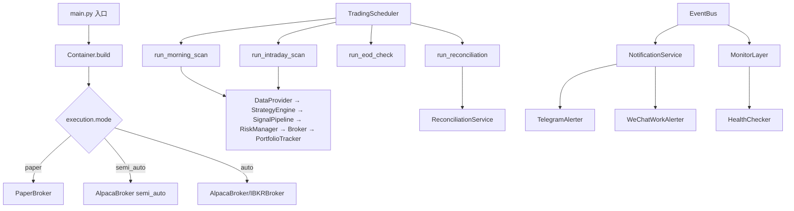

## 用户需求

基于 Phase 2 已完成的 Paper Trading 基础设施（202 个测试全通过），进行 Phase 3 开发，将系统从"完全纸面交易"升级为"人工确认半自动下单"，并为未来全自动执行奠定基础。

## 产品概述

Phase 3 目标是在现有 Paper Broker 之上，增加真实券商接入能力（Alpaca 美股 + IBKR 港美股）、通知推送系统（Telegram/企业微信）、定时任务调度器、依赖注入容器，以及监控层（健康检查 + 结构化日志 + 对账服务）。最终形成一个完整的半自动交易闭环：系统自动生成信号 → 推送通知给用户 → 用户确认 → 系统按指令执行真实下单。

## 核心功能

### P0：基础设施扩展

- **依赖注入容器**（`infra/container.py`）：工厂模式，根据 `execution.mode` 配置一键切换 Paper/Alpaca/IBKR Broker；统一装配所有模块依赖
- **定时任务调度器**（`infra/scheduler.py`）：APScheduler 封装，支持盘前扫描（09:35 ET）、盘中每 30 分钟更新、收盘前检查（15:45 ET）、盘后对账（16:30 ET）；任务执行保护（熔断检查 + 异常不崩溃）

### P1：执行引擎扩展

- **Alpaca Broker**（`execution/alpaca_broker.py`）：对接 Alpaca Markets API，支持 Paper/Live 双模式切换，实现 `BrokerProtocol`，提交市价单，解析订单状态回报
- **IBKR Broker**（`execution/ibkr_broker.py`）：通过 ib_insync 接入 Interactive Brokers TWS/Gateway，支持港美股，实现自动重连机制
- **通知服务**（`execution/notification.py`）：订单 JSON 生成 + Telegram Bot 推送 + 企业微信 Webhook 推送；告警级别分层（INFO/WARN/ERROR/CRITICAL）；通知内容包含信号详情、建议仓位、止损止盈价

### P2：监控与对账

- **监控层**（`monitor/`）：健康检查（数据源/券商 API/数据库/调度器）；结构化日志配置（loguru，按日轮转，保留 30 天）；告警规则（止损触及、熔断触发、系统异常）
- **对账服务**（`portfolio/reconciliation.py`）：定期对比本地持仓与券商真实持仓，差异自动告警并以券商数据为准修正
- **运行入口**（`main.py`）：统一的系统启动入口，支持 `--mode paper/semi_auto/auto` 参数

### 测试覆盖

Phase 3 新增测试文件覆盖所有新模块，全量测试（Phase 1+2+3）须保持 0 failed。

## 技术栈选型

沿用 Phase 1/2 已确立的技术栈，新增以下依赖：

| 包 | 版本 | 用途 |
| --- | --- | --- |
| `alpaca-py` | ≥0.20.0 | Alpaca 美股 REST API |
| `ib_insync` | ≥0.9.86 | IBKR 港美股 API |
| `APScheduler` | ≥3.10.0 | 定时任务调度 |
| `httpx` | ≥0.27.0 | Telegram/企业微信 HTTP 推送 |


## 实现策略

**核心思路**：以 `BrokerProtocol`（Phase 2 已定义）为扩展点，新增 AlpacaBroker/IBKRBroker 实现类；通过 `infra/container.py` 工厂统一装配，调用方无需感知 Broker 具体实现。通知服务作为 EventBus 的 subscriber，监听 `ORDER_FILLED` / `CIRCUIT_BREAKER_TRIGGERED` 等事件，异步推送通知，不阻塞主流程。

**关键设计决策**：

1. **Broker 扩展方式**：AlpacaBroker 和 IBKRBroker 实现已有 `BrokerProtocol`（`submit` + `cancel`），无需修改上层 RiskManager/PortfolioTracker，符合开闭原则。
2. **半自动模式实现**：`execution.mode = "semi_auto"` 时，Broker 先将 OrderIntent 序列化为 JSON 推送通知，等待人工确认后才调用真实 API 下单；`auto` 模式直接下单。两种模式通过同一 BrokerProtocol 接口，对外透明。
3. **APScheduler 选型**：使用 `BlockingScheduler`（主进程阻塞运行）适合个人单机部署；设置 `misfire_grace_time=60s` 防止因短暂延迟跳过任务；每个 job 独立 try-except 保护，不因单次失败停止调度。
4. **IBKR 连接管理**：ib_insync 需要本地运行 TWS/IB Gateway，须实现自动重连（`ib.connectedEvent`）和连接超时检测；测试时用 Mock 替代真实连接，不依赖外部服务。
5. **通知防骚扰**：引入 `alert_cooldown_seconds`（同类告警最小间隔），避免连续错误重复发送；所有通知捕获异常，失败只记日志，不影响主流程（符合设计文档 §7.3 原则）。

## 性能与可靠性

- EventBus handler 已有异常隔离（Phase 2），通知服务作为 subscriber 天然隔离
- APScheduler job 执行时长不超过调度间隔（日线策略扫描 < 30s），无背压问题
- Alpaca/IBKR API 调用加超时控制（默认 10s），超时后记录告警，不阻塞

## 架构设计



## 目录结构

```
mytrader/
├── mytrader/
│   ├── infra/
│   │   ├── config.py           # [MODIFY] 新增 AlpacaConfig/IBKRConfig/NotificationConfig/SchedulerConfig 子配置块
│   │   ├── event_bus.py        # [MODIFY] 新增 HEALTH_CHECK_FAILED/RECONCILIATION_DIFF 事件常量
│   │   ├── container.py        # [NEW] 依赖注入容器：build_app() 工厂，根据 mode 装配 Broker + 全量模块
│   │   └── scheduler.py        # [NEW] TradingScheduler：APScheduler 封装，4个定时 job，熔断前置检查
│   │
│   ├── execution/
│   │   ├── alpaca_broker.py    # [NEW] AlpacaBroker 实现 BrokerProtocol，支持 paper/live 双模式，市价单 + 订单状态轮询
│   │   ├── ibkr_broker.py      # [NEW] IBKRBroker 实现 BrokerProtocol，ib_insync 连接管理 + 自动重连
│   │   └── notification.py     # [NEW] NotificationService + TelegramAlerter + WeChatWorkAlerter，级别分层，防骚扰冷却
│   │
│   ├── portfolio/
│   │   └── reconciliation.py   # [NEW] ReconciliationService：对比本地 Portfolio vs 券商持仓，差异告警 + 修正
│   │
│   └── monitor/                # [NEW] 监控层（新增目录）
│       ├── __init__.py
│       ├── health_checker.py   # [NEW] HealthChecker：数据源/Broker/DB/Scheduler 4项健康检查，返回 HealthReport
│       └── logger_setup.py     # [NEW] setup_logger()：loguru 配置，按日轮转，JSON 序列化，30天保留
│
├── tests/
│   ├── test_container.py       # [NEW] 测试 Container 工厂：paper/semi_auto 模式装配，mock broker 替换
│   ├── test_scheduler.py       # [NEW] 测试 TradingScheduler：job 注册、熔断跳过、异常不崩溃
│   ├── test_alpaca_broker.py   # [NEW] 测试 AlpacaBroker：BUY/SELL 提交、幂等性、订单解析（Mock alpaca-py）
│   ├── test_notification.py    # [NEW] 测试 NotificationService：消息格式、冷却期去重、渠道异常隔离
│   ├── test_reconciliation.py  # [NEW] 测试 ReconciliationService：持仓一致/差异/券商侧不存在等场景
│   └── test_monitor.py         # [NEW] 测试 HealthChecker：全健康/降级/各检查项失败场景
│
├── config/
│   ├── default.yaml            # [MODIFY] 新增 alpaca/ibkr/notification/scheduler 配置节
│   └── .env.example            # [MODIFY] 新增 ALPACA_API_KEY/TELEGRAM_BOT_TOKEN 等示例环境变量
│
├── main.py                     # [NEW] 系统启动入口：argparse 解析 --mode/--config，初始化日志，Container.build，Scheduler.start
└── doc/
    └── phase3-summary.md       # [NEW] Phase 3 开发总结文档
```

## 关键接口定义

**AlpacaBroker**（实现 BrokerProtocol）：

```python
class AlpacaBroker:
    def __init__(self, api_key: str, secret_key: str, paper: bool = True, mode: str = "auto"): ...
    def submit(self, intent: OrderIntent, df: pd.DataFrame) -> OrderResult: ...
    def cancel(self, client_order_id: str) -> bool: ...
```

**NotificationService**（EventBus subscriber）：

```python
class NotificationService:
    def notify_order(self, intent: OrderIntent, result: OrderResult) -> None: ...
    def notify_alert(self, level: str, message: str, extra: dict = {}) -> None: ...
```

**Container 工厂**：

```python
def build_app(config: AppConfig) -> TradingApp: ...  # 根据 config.execution.mode 选择 Broker
```

## Agent Extensions

### MCP

- **codebuddy-mem**
- Purpose: 检索 Phase 1/2 开发过程中的历史决策记录（如 BrokerProtocol 接口设计、VectorBT 1.0.0 破坏性变更注意点），确保 Phase 3 实现与历史决策保持一致
- Expected outcome: 在实现 AlpacaBroker/IBKRBroker 前，确认现有 BrokerProtocol 接口签名和 OrderResult 数据结构的历史约定，避免引入不兼容变更