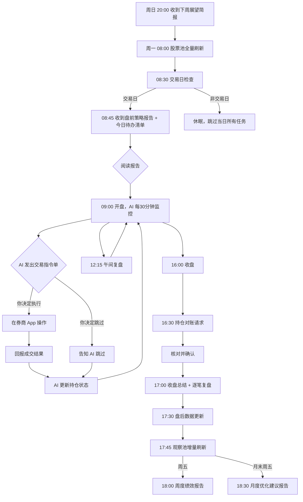

# 港股量化交易助手 (hk-quant-advisor)

> OpenClaw Skill · v1.0.2

## 📖 目录

- [功能简介](#功能简介)
- [核心能力](#核心能力)
- [数据源 Skill 依赖](#数据源-skill-依赖)
- [环境要求](#环境要求)
- [安装部署](#安装部署)
  - [1. 安装 OpenClaw 平台](#1-安装-openclaw-平台)
  - [2. 安装数据源 Skill](#2-安装数据源-skill)
  - [3. 启动与初始化](#3-启动与初始化)
- [日常交互指南](#日常交互指南)
  - [首次启动：新手引导](#首次启动新手引导)
  - [盘中交互流程](#盘中交互流程)
  - [成交回报](#成交回报)
  - [指令跳过](#指令跳过)
  - [参数热更新](#参数热更新)
  - [日常对账](#日常对账)
- [定时报告说明](#定时报告说明)
- [策略简介](#策略简介)
- [风控机制](#风控机制)
- [文件结构](#文件结构)
- [交互式引导系统](#交互式引导系统)
- [常见问题 FAQ](#常见问题-faq)
- [免责声明](#免责声明)

---

## 功能简介

**hk-quant-advisor** 是一个部署在 [OpenClaw](https://openclaw.ai) 平台上的港股量化交易决策 AI Skill。它模拟了**交易员 + 风控官 + 绩效分析师**三重角色，基于多维度实时数据，运行精确量化策略，为你的港股账户生成标准化的**交易指令单**。

**你需要做的**：根据 AI 生成的指令单，在你的券商 App 中手动执行买卖操作，然后将成交结果回报给 AI。

**AI 负责的**：数据抓取 → 技术分析 → 信号生成 → 风险控制 → 持仓跟踪 → 绩效评估 → 策略自我优化。

> ⚠️ 本 Skill **不会**直接连接你的券商账户进行自动下单。所有交易的最终执行权在你手中。

---

## 核心能力

| 能力 | 说明 |
|------|------|
| 🔍 **多源数据采集** | 实时行情、基本面、资金流向、新闻舆情、宏观数据，多源自动切换与容错。免费数据源
Skill：`westock-data`（腾讯证券，内网Knot）、`tecent-finance`（腾讯证券）、`yahoo-finance`（雅虎金融）、`akshare-finance`（AKShare）；付费数据源
Skill（可选）：`tushare-finance`（Tushare 金融）、`finance`（AlphaVantage & TwelveData）；通用数据源：港交所（披露易/CCASS/互联互通）、恒生指数公司；Browser_Skill 补充：财联社、雪球等 |
| 📊 **四大量化策略** | 趋势突破、回调低吸、事件驱动、极端情绪反转，每个策略都有精确量化触发条件 |
| 🛡️ **三层风控体系** | 个股止损（静态+移动+跳空） → 账户级保护（仓位上限+凯利公式） → 应急风控（恒指急跌自动减仓/清仓） |
| 📋 **标准化指令单** | JSON + Markdown 双格式输出，包含标的、价格、数量、止损位等完整可执行信息 |
| 💼 **持仓全程管理** | 成本价、浮盈亏、持仓天数、最高价（移动止损用）全部自动跟踪 |
| 📈 **绩效自动评估** | 每日/每周/每月多维度绩效报告，策略胜率、盈亏比、夏普比率等核心指标 |
| 🔄 **策略自我优化** | 8 类错误模式自动识别与纠正、参数敏感性回测、市场匹配度分析、策略衰退降权 |
| ⚙️ **参数热更新** | 自然语言或 JSON 即可实时调整所有策略阈值，无需重启 |
| 📅 **港股日历感知** | 自动识别港股特有假期（佛诞、重阳、中秋翌日等）、台风停市、半日市 |
| 🤝 **交互式引导** | AI 主动引导：新手 Onboarding、每日待办清单、操作步骤提示、术语通俗翻译、教学时刻 |
| 🧠 **用户自适应** | 自动感知用户专业度（新手/进阶/专业）× 活跃度（高/低/沉默），动态调整交互风格 |
| ⏰ **12 项定时任务** | 全自动日历驱动：从周日下周展望到每日盘前→盘中30min监控→收盘总结→盘后数据更新，非交易日自动休眠 |
| 💾 **运行时数据自管理** | 11 个 JSON 文件全自动维护：账户状态、持仓、交易记录、待确认指令、运行时参数、黑名单、错误模式库、优化日志、信号快照、待补发通知、股票池，Skill 重启后自动恢复 |

---

## 数据源 Skill 依赖

本 Skill 通过调用外部**数据源 Skill** 获取所有财经数据，自身不内置任何数据抓取逻辑。数据源分为免费和付费两类：

### 免费数据源 Skill（必选，无需 API Token）

| 财经数据源名称 | Skill 名称 | 说明 |
|---|---|---|
| 腾讯证券（内网） | `westock-data` | 港股实时行情、历史 K 线、基本面数据（内网Knot，**默认主数据源**，通过 `knot_skills` 安装，失败时需手工安装） |
| 腾讯证券（外网） | `tecent-finance` | 港股实时行情、历史 K 线、基本面数据（外网 ClawHub 可下载，**第一降级源**） |
| 雅虎金融 | `yahoo-finance` | 全球市场行情、基本面、汇率数据（外网 ClawHub，**第二降级源**） |
| AKShare 财经 | `akshare-finance` | A股/港股行情、宏观经济、资金流向数据（外网 ClawHub，**第三降级源**） |

### 付费数据源 Skill（可选，需 API Token）

| 财经数据源名称 | Skill 名称 | 说明 |
|---|---|---|
| Tushare 金融 | `tushare-finance` | 港股行情、港股通资金、Hibor 利率、国际指数等（需 [Tushare Pro](https://tushare.pro/register) Token） |
| AlphaVantage & TwelveData | `finance` | 全球市场行情、外汇、技术指标等（需 API Key） |

> 💡 **优先级规则**：付费数据源（若可用）优先于免费数据源；免费数据源之间按 `westock-data` → `tecent-finance` → `yahoo-finance` → `akshare-finance` 顺序降级。
>
> 💡 **最低运行要求**：至少 1 个免费数据源 Skill 可用即可正常运行。付费数据源未配置不影响任何功能。

---

## 环境要求

| 组件 | 要求 |
|------|------|
| **OpenClaw 平台** | v2.0+ |
| **必需 Skill** | `Browser_Skill`（网页抓取）、`File_Skill`（文件读写/PDF解析）、`NLP_Skill`（自然语言处理/情感分析） |
| **数据源 Skill（必选）** | `westock-data`（腾讯证券，内网Knot，通过 `knot_skills` 安装）、`tecent-finance`（腾讯证券）、`yahoo-finance`（雅虎金融）、`akshare-finance`（AKShare）— 至少安装 1 个 |
| **数据源 Skill（可选）** | `tushare-finance`（Tushare 金融）、`finance`（AlphaVantage & TwelveData）— 需配置 API Token |
| **平台内置能力** | `System_Skill`（系统操作）、`cron`（定时任务调度器）— 由 OpenClaw 平台内置提供，无需单独安装 |
| **网络** | 需可访问香港交易所、各数据源 Skill 依赖的服务端点 |
| **时区** | 系统自动以 `Asia/Hong_Kong` (HKT, UTC+8) 为基准 |

---

## 安装部署

### 1. 安装 OpenClaw 平台

如果尚未安装 OpenClaw，请参照官方文档：

```bash
# macOS / Linux
curl -fsSL https://get.openclaw.ai | bash

# Windows (PowerShell)
irm https://get.openclaw.ai/install.ps1 | iex

# 验证安装
openclaw --version
```

安装完成后，确保以下基础 Skill 已启用：

```bash
# 检查已安装的 Skill
openclaw skills list
```

### 2. 安装数据源 Skill

```bash
# 必选：免费数据源 Skill（建议全部安装，至少安装 1 个）
# westock-data（腾讯证券-内网Knot，默认主数据源）    # 通过 knot_skills 自动安装，若失败请前往 OpenClaw 技能页面 → 来自 Knot 下手工安装
npx clawhub@latest install tecent-finance    # 腾讯证券-ClawHub（第一降级源）
npx clawhub@latest install yahoo-finance     # 雅虎金融-ClawHub（第二降级源）
npx clawhub@latest install akshare-finance   # AKShare-ClawHub（第三降级源）

# 可选：付费数据源 Skill（配置 API Token 后可用，通过 ClawHub 安装）
npx clawhub@latest install tushare-finance   # Tushare 金融
npx clawhub@latest install finance           # AlphaVantage & TwelveData
```

> 💡 付费数据源未配置不影响系统运行。系统启动时会自动检测各 Skill 可用性并选择最优数据源。

### 3. 启动与初始化

启动后 AI 自动执行 8 步初始化，全程 AI 主导：

1. ✅ 技能与数据源 Skill 可用性检查（自动，通过 `openclaw skills list` / `openclaw skills info` 逐一验证）
2. ✅ 交易日历加载（自动）
3. ✅ 数据源 Skill 连通性测试（自动）
4. 🤝 **新手引导开始** — AI 主动引导你设置账户（总资金、持仓、风险偏好）
5. ✅ 历史数据拉取（自动，首次约 5-10 分钟）
6. ✅ 策略参数加载（自动）
7. ✅ 定时任务注册（自动，通过 `openclaw cron add` CLI 命令逐条注册 12 项定时任务）
8. ✅ 发送确认消息 + 快捷指令提示

> 💡 你只需跟随 AI 提示回答问题即可。不需要记任何命令。

---

## 日常交互指南

### 首次启动：新手引导

AI 首次启动时会主动引导你完成设置，分 4 步：

1. **👋 欢迎与自我介绍** — AI 介绍自己的三重角色和能力边界
2. **📝 账户信息采集** — 引导式提问：总资金？有没有持仓？
3. **⚙️ 偏好设置（可选）** — 风险偏好（保守/标准/激进）、交互模式（新手/专业），可跳过使用默认值
4. **✅ 设置确认** — AI 回显配置并开始初始化

示例：
```
AI: 你的港股账户总资金是多少？
你: 50万
AI: 目前有持仓吗？如果有，请告诉我持仓明细。
你: 空仓
AI: ✅ 设置完成！总资金50万港币，空仓。正在初始化数据...
```

> 💡 即使回答不完整或格式不对，AI 也会智能解析并仅追问缺失部分。

### 盘中交互流程

典型的一天交互流程：



### 成交回报

每次在券商 App 完成交易后，请尽快告知 AI：

**自然语言方式**（推荐）：
```
成交回报：买入 00700.HK 2000股 成交价341.2 时间10:32
```
```
已卖出 03690.HK 全部3000股 成交价115.5
```

**JSON 方式**：
```json
{"action": "BUY", "symbol": "00700.HK", "quantity": 2000, "price": 341.2, "time": "10:32"}
```

> ⚠️ 若 AI 发出指令后 **30 分钟**未收到你的回报或跳过通知，AI 会主动提醒。**60 分钟**后自动标记指令为过期/未执行。

### 指令跳过

如果你决定不执行某条指令：
```
跳过 00700.HK 买入指令
```
```
今天所有买入指令都跳过
```

AI 会将指令标记为"用户跳过"，不影响后续策略运行和复盘分析。

### 参数热更新

你可以随时调整策略参数，无需重启：

**自然语言方式**：
```
将静态止损调整为 -5%
移动止损激活阈值改为 +8%
单只股票仓位上限调为 12%
现金比例提高到 20%
恢复默认参数
```

**JSON 方式**：
```json
{"type": "PARAM_UPDATE", "updates": [{"category": "stop_loss", "param": "static_stop_loss_pct", "newValue": -0.05, "reason": "用户手动调整"}]}
```

常用可调参数速查：

| 你说 | 对应参数 | 默认值 | 允许范围 |
|------|----------|--------|----------|
| "止损调为 -5%" | 静态止损比例 | -7% | -5% ~ -10% |
| "移动止损激活改为 8%" | 移动止损激活阈值 | +10% | +5% ~ +20% |
| "回撤比例改为 4%" | 移动止损回撤比例 | 5% | 3% ~ 8% |
| "单只上限调为 12%" | 核心池单股上限 | 15% | 8% ~ 20% |
| "现金比例提高到 20%" | 最低现金保留 | 10% | 5% ~ 30% |
| "刷新间隔改为 3 分钟" | 盘中监控周期 | 5 分钟 | 1 ~ 15 分钟 |
| "日交易上限调为 6 次" | 全账户日交易上限 | 8 次 | 3 ~ 15 次 |
| "市值门槛降为 50 亿" | 核心池市值门槛 | 80 亿 | 30 ~ 200 亿 |

### 日常对账

每日 16:30 收盘后，AI 会发送持仓汇总请你核对：

```
AI: 以下是今日收盘后持仓状态，请确认是否与您的券商账户一致：
┌──────────┬──────┬──────┬──────┬──────┐
│ 标的      │ 数量  │ 成本  │ 现价  │ 浮盈  │
├──────────┼──────┼──────┼──────┼──────┤
│ 00700.HK │ 2000 │ 330  │ 345  │+4.5% │
│ 09988.HK │ 4000 │ 78.5 │ 80.2 │+2.2% │
└──────────┴──────┴──────┴──────┴──────┘
现金：35万 / 总资产：100.2万

如有差异请告知，无误请回复"确认"。
```

你只需回复：
```
确认无误
```
或：
```
差异：00700实际持仓是2200股，之前漏报了200股加仓
```

> ⚠️ 连续 **3 个交易日**未对账，AI 会在盘前报告中**标红提醒**。

---

## 定时报告说明

| 时间 (HKT) | 报告名称 | Cron 表达式 | 内容概述 |
|-------------|----------|-------------|----------|
| **每周日 20:00** | 🔭 下周展望简报 | `0 20 * * 0` | 下周重要宏观事件、财报日历、期权到期、技术关键位 |
| **每周一 08:00** | 🔄 股票池全量刷新 | `0 8 * * 1` | 全量刷新核心池/观察池/黑名单，更新基本面评分卡 |
| **08:30** | 📆 交易日检查 | `30 8 * * 1-5` | 确认当日是否为交易日（含半日市判断） |
| **08:45** | 📋 盘前策略报告 | `45 8 * * 1-5` | 市场立场判定、支撑阻力、观察名单、隔夜外盘 |
| **09:00-16:00** | 🔔 盘中实时监控 | `*/30 9-16 * * 1-5` | 每30分钟：09:00-09:30 仅竞价数据刷新，09:30 后刷新数据→扫描策略→更新持仓→触发指令 |
| **12:15** | 📊 午间复盘 | `15 12 * * 1-5` | 上午成交汇总、资金流向更新、下午关注点 |
| **16:30** | ✅ 持仓对账请求 | `30 16 * * 1-5` | 当日持仓汇总表，请求用户核对 |
| **17:00** | 📝 收盘总结 | `0 17 * * 1-5` | 成交记录、盈亏统计、逐笔复盘、错误模式检测 |
| **17:30** | 📥 盘后数据更新 | `30 17 * * 1-5` | 披露易公告、港股通资金、卖空数据、CCASS变动 |
| **17:45** | 🔍 观察池增量刷新 | `45 17 * * 1-5` | 更新观察池行情/指标/资金流，检查核心池晋升条件 |
| **每周五 18:00** | 📈 周度绩效报告 | `0 18 * * 5` | 策略胜率/盈亏比、健康度评级、复盘深度报告 |
| **月末周五 18:30** | 🔬 月度优化建议 | `30 18 25-31 * 5` | 参数回测、市场匹配度、止损有效性、优化建议 |

**特殊日期处理**：
- **非交易日**：自动跳过除《下周展望》外的所有任务
- **半日市**（如圣诞前夕、农历新年前夕）：盘中监控截止至 11:55，取消午间复盘，持仓对账提前至 12:30，收盘总结提前至 13:00
- **台风/暴雨停市**：检测到港交所紧急公告后自动进入休眠模式

**通知策略**：
- 发送失败 → 重试 3 次（间隔 1 分钟），仍失败则缓存本地，下次连接时补发
- 应急风控触发 → 主通道 + 备用通道双发

---

## 策略简介

| # | 策略名称 | 适用场景 | 核心触发逻辑 | 预期持仓周期 |
|---|---------|----------|-------------|-------------|
| 1 | **趋势突破** | 横盘整理后的放量突破 | 15日平台突破 + 量比>2 + MACD金叉 + MA20向上 + RSI 55-80 + 资金验证 | 8-15 日 |
| 2 | **回调低吸** | 上升趋势中的回踩支撑 | 周线趋势3周向上 + 回踩MA30/60 + 反转K线 + 缩量企稳 + 动能衰竭 | 5-10 日 |
| 3 | **事件驱动** | 业绩超预期/回购/增持 | 营收>20% + 净利>25% + 跳空>4% + 放量确认 / 回购占市值>1.5% | 3-8 日 |
| 4 | **极端情绪反转** | 恐慌性超跌后的技术反弹 | RSI<18 + KDJ.J<-5 + 3日跌>15% + 基本面安全 + 大盘RSI<28 + **分批建仓** | 2-5 日 |

每个策略都有精确的量化买入/卖出条件、成本收益检查和信号快照记录。详见提示词模块 `04_strategies.md`。

**策略仲裁优先级**（当同一标的触发多个信号时）：
```
应急风控 > 强制止损 > 移动止损 > 策略四 > 策略三 > 策略一 > 策略二
```

---

## 风控机制

```
┌───────────────────────────────────────────────────────────┐
│                    第一层：个股止损                          │
│  静态止损(-7%) · 移动止损(盈利>10%激活,最高价×0.95)          │
│  跳空止损(限价→15min后市价) · 横盘止损(15日浮盈亏在±3%内)     │
├───────────────────────────────────────────────────────────┤
│                    第二层：账户级保护                        │
│  核心池单股≤15% · 观察池≤8% · 低流动性≤5%                    │
│  ATR凯利公式(单笔风险=净值×1%) · 现金≥10% · 日亏>3%熔断       │
├───────────────────────────────────────────────────────────┤
│                    第三层：应急风控                          │
│  恒指急跌→全仓减仓 · 恒指暴跌→全仓清仓                       │
│  连续3日亏损>5%→降档减仓 · 台风/暴雨→休眠模式                 │
└───────────────────────────────────────────────────────────┘
```

**市场立场系统**（每日 08:50 判定）：

| 立场 | 仓位系数 | 可用策略 | 触发条件概述 |
|------|---------|----------|-------------|
| 🟢 激进做多 | 90% | 全部四大策略 | 恒指>MA20且MA20向上，VHSI<22 |
| 🟡 谨慎做多 | 60% | 策略一+二+三+四（需RSI<28） | 恒指在MA20±1.5%内，22≤VHSI≤27 |
| 🟠 中性观望 | 30% | 仅策略三+四 | 恒指<MA20但>MA60，27<VHSI≤33 |
| 🔴 持币防守 | 10% | 仅策略四（极端反转） | 恒指<MA60且MA20向下，VHSI>33 |

**紧急熔断条件**（任一触发即暂停所有新开仓）：
1. 恒指 5 分钟内急跌超阈值
2. 港交所发布紧急公告（八号风球/黑色暴雨）
3. 交易指令单出现逻辑矛盾
4. 主备数据源同时失效 > 5 分钟
5. 单日已实现亏损 > 账户净值 3%

---

## 文件结构

```
hk-quant-advisor/
│
├── SKILL.md                              # OpenClaw Skill 入口（YAML元数据 + 模块加载 + 初始化指令）
├── README.md                             # 📖 本文档
│
├── config/
│   ├── data_sources.json                 # 数据源 Skill 映射配置（优先级链 + 降级规则 + 异常检测阈值）
│   └── strategy_params.json              # 策略参数默认值（全局 + 四大策略 + 风控 + 筛选）
│
├── prompts/
│   └── modules/                          # 9 个模块化 Prompt 文件（按顺序加载为系统指令）
│       ├── 01_role_and_principles.md     # 三重角色、铁律、熔断、成本模型、交易日历
│       ├── 02_data_acquisition.md        # 数据源 Skill 架构 + 五维数据需求 + 技术指标计算
│       ├── 03_stock_pool.md              # 三级股票池：核心池/观察池/黑名单
│       ├── 04_strategies.md              # 四大策略：趋势突破/回调低吸/事件驱动/情绪反转
│       ├── 05_risk_management.md         # 三层风控 + 市场立场 + 仓位管理
│       ├── 06_portfolio_management.md    # 持仓管理 + 对账 + 成交回报解析 + 状态恢复
│       ├── 07_performance_and_optimization.md # 绩效追踪 + 策略评估 + 错误模式 + 参数优化
│       ├── 08_output_format.md           # JSON/Markdown输出模板 + 初始化流程
│       └── 09_interactive_guide.md       # Onboarding + 每日引导 + 教学时刻 + 自适应
│
├── schemas/
│   ├── trade_order.schema.json           # 交易指令单 JSON Schema
│   ├── system_status.schema.json         # 系统状态消息 JSON Schema
│   ├── optimization_report.schema.json   # 月度优化报告 JSON Schema
│   └── param_update.schema.json          # 参数更新指令 JSON Schema
│
├── triggers/
│   └── scheduled_tasks.json              # 12 项定时任务 Cron 配置
│
└── portfolio/                            # ⚡ 运行时数据（自动生成，不纳入版本管理）
    ├── README.md                         # 运行时文件说明
    ├── .templates/                       # 📋 初始化模板（纳入版本管理，首启时复制到上层目录）
    │   ├── account_state.json            # 账户状态模板
    │   ├── positions.json                # 持仓明细模板
    │   ├── trade_log.json                # 交易记录模板
    │   ├── pending_orders.json           # 待确认指令模板
    │   ├── strategy_params.json          # 运行时策略参数模板
    │   ├── blacklist.json                # 黑名单模板
    │   ├── error_patterns.json           # 错误模式库模板
    │   ├── optimization_log.json         # 优化建议历史模板
    │   ├── signal_snapshots.json         # 信号快照模板
    │   ├── pending_notifications.json    # 待补发通知队列模板
    │   └── stock_pool.json               # 股票池（核心池+观察池）模板
    ├── account_state.json                # 账户状态（自动创建）
    ├── positions.json                    # 持仓明细（自动创建）
    ├── trade_log.json                    # 交易记录（自动创建）
    ├── pending_orders.json               # 待确认指令（自动创建）
    ├── strategy_params.json              # 运行时策略参数（自动创建）
    ├── blacklist.json                    # 黑名单（自动创建）
    ├── error_patterns.json               # 错误模式库（自动创建）
    ├── optimization_log.json             # 优化建议历史（自动创建）
    ├── signal_snapshots.json             # 信号快照（自动创建）
    ├── pending_notifications.json        # 待补发通知队列（自动创建）
    └── stock_pool.json                   # 股票池（核心池+观察池）（自动创建）
```

---

## 交互式引导系统

本 Skill 专为零基础用户设计了 **AI 主动引导**机制：

| 场景 | AI 的主动行为 |
|------|-------------|
| **首次启动** | 4 步引导式 Onboarding：欢迎 → 账户采集 → 偏好设置 → 确认 |
| **每日盘前** | 在报告开头附带"今日待办清单"，告诉你今天该做什么 |
| **发出交易指令时** | 附带完整操作指引：在券商 App 怎么操作、操作完怎么回复 |
| **你忘了回报** | 30 分钟温和提醒，60 分钟自动标记过期 |
| **你忘了对账** | 连续 3 天未对账标红提醒 |
| **你长时间沉默** | 3 天无互动后主动关怀，询问是否继续 |
| **首次止损** | 插入教学："止损不是失败，是保护本金的必要成本" |
| **首次盈利** | 提醒移动止损机制，锁定利润 |
| **大跌但 AI 未操作** | 主动解释"不交易也是策略"，避免焦虑 |
| **专业术语** | 首次出现时自动翻译（如 RSI = "衡量股票涨/跌过头的指标"） |
| **周末/假期** | 主动提醒假期安排和下个交易日时间 |

**用户自适应矩阵**：

| | 高活跃度 | 低活跃度 | 沉默 |
|---|---------|---------|------|
| **新手** | 详细解释 + 操作步骤 | 精简 + 关键步骤 | 主动关怀 + 待办汇总 |
| **进阶** | 数据 + 简要理由 | 结论 + 关键变化 | 仅异常提醒 |
| **专业** | 原始数据 + 图表 | 摘要 + 异常标注 | 仅紧急通知 |

**快捷指令**：随时发送"**帮助**"查看所有可用指令（查询类、设置类、操作类、帮助类四大分组）。

---

## 常见问题 FAQ

### Q1: 数据源 Skill 需要全部安装吗？
**A:** 不需要。4 个免费数据源 Skill（`westock-data`、`tecent-finance`、`yahoo-finance`、`akshare-finance`）至少安装 1 个即可运行，建议全部安装以获得最佳降级容错能力。2 个付费数据源 Skill 完全可选。

### Q2: 付费数据源和免费数据源有什么区别？
**A:** 付费数据源通常提供更丰富的数据维度（如 Hibor 利率、港股通十大成交股等）和更高的稳定性。系统会优先使用付费数据源（若已配置），付费源不可用时自动降级到免费源。对中低频交易者而言，免费数据源完全够用。

### Q3: AI 发出指令我一定要执行吗？
**A:** 不需要。所有指令都是建议性质，最终执行权在你。跳过时请告知 AI，以便准确维护持仓状态。

### Q4: 忘了回报成交怎么办？
**A:** AI 会在 30 分钟后主动提醒。长期不同步会导致持仓数据偏差，影响风控和策略效果。建议每日 16:30 对账。

### Q5: 策略参数调了怎么恢复？
**A:** 告诉 AI "恢复默认参数"，系统会从 `config/strategy_params.json` 重新加载原始默认值。

### Q6: 为什么 AI 给的是价格区间而非精确价格？
**A:** 区间考虑了流动性和滑点。在区间内下限价单即可。大额订单时 AI 会自动建议冰山委托拆单。

### Q7: 月度优化建议会自动执行吗？
**A:** 不会。月度优化建议默认 `autoApply: false`，需你确认。但以下会自动执行：错误模式纠正、策略衰退降权、过度交易防护。

### Q8: Skill 重启后数据会丢失吗？
**A:** 不会。所有运行时数据持久化在 `portfolio/` 目录下的 11 个 JSON 文件中，重启后自动恢复。

### Q9: 支持多账户吗？
**A:** 当前版本为单账户设计。多账户可复制 Skill 目录并分别配置不同的 `portfolio/` 路径。

### Q10: 我是完全新手，看不懂怎么办？
**A:** AI 默认以新手模式运行，会主动用通俗语言解释所有术语，并在交易操作时给出详细步骤（如"在券商App中输入代码00700，选择买入，数量填2000，价格填341"）。遇到不懂的直接问"什么是XXX"。

### Q11: AI 会主动告诉我该做什么吗？
**A:** 会。这是核心设计理念 — **AI 为主、用户为辅**。每天盘前有"今日待办清单"；指令附带操作步骤和回复示例；忘了操作会提醒；没交易的日子也会告诉你"今天可以休息"。

### Q12: 如果所有数据源 Skill 都不可用怎么办？
**A:** 系统会暂停所有信号生成，但**保留止损监控**（基于最后已知数据），同时通知你手动关注。数据源 Skill 恢复后自动继续。建议安装所有 4 个免费数据源 Skill 以降低全部不可用的风险。

---

## 免责声明

1. **非投资建议**：本系统生成的所有信号均基于公开数据和量化模型，**不构成法律意义上的投资建议**。
2. **风险自担**：用户需自行承担交易决策的全部后果。AI 不对任何交易盈亏负责。
3. **技术限制**：AI 尽力确保数据准确和策略一致性，但不对以下情况导致的损失负责：
   - 数据源 Skill 中断、延迟或返回数据异常
   - 模型在极端市场条件下失效
   - 网络故障导致指令延迟或丢失
   - 港交所临时停市或规则变更
4. **合规声明**：系统不进行任何内幕交易、市场操纵或其他违反香港《证券及期货条例》的行为。
5. **市场风险**：港股市场存在汇率风险、流动性风险、政策风险等，过往策略表现不代表未来收益。
6. **数据来源**：数据通过外部数据源 Skill 获取，本系统不对第三方数据源的准确性和完整性做任何保证。

---

> 📬 如有问题或建议，请联系rickywxchen。
